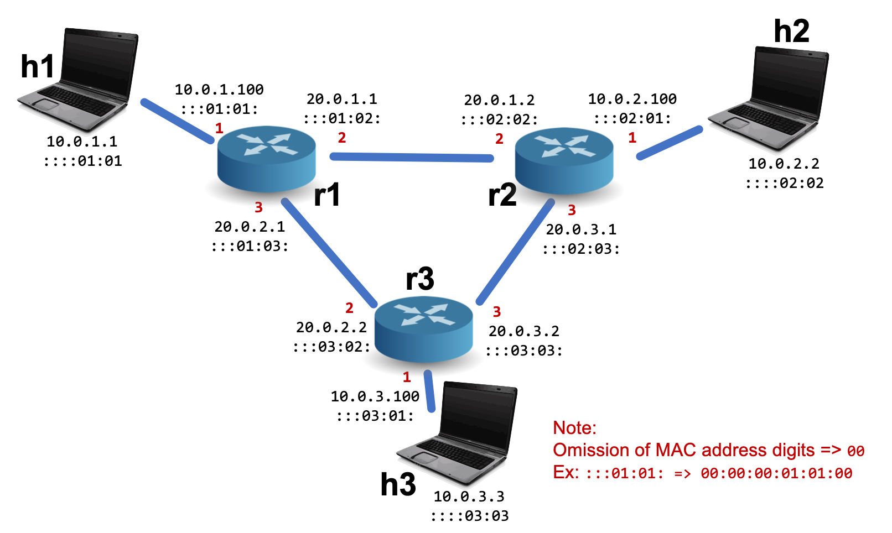

# Project 4: Finishing Our Router Implementation

This project is to be done individually.  Please refer to Canvas for the deadline.

## Introduction

In HW2, you implemented a simple 'static' router.
The router could act as a layer-2 endpoint, demultiplex to layer-3, forward IPv4 packets, and handle ARP requests.
However, all of those behaviors were statically configured in the control plane.
In HW3, we saw how routers actually implement dynamic behavior like the distributed computation of routing tables.

In this project, you will take your HW2 and HW3 implementations and complete a full implementation of an Internet router.
Specifically, you will begin with your HW2 implementation and iteratively replace all of the hardcoded values until the router is able to take a simple local configuration file (with local IP, MAC address, etc.) and fill in the rest automatically with the help of Distance Vector and ARP protocols.


## Part A: Cloning the Updated Framework

You can clone and build the framework exactly as you did in HW0 - HW2.
For now, the topology that we will use in this homework is identical to HW2:



Eventually, you will want to start copying pieces of your HW2 `data_plane.p4` and `control_plane.py` code into this new codebase.
Before you do that, however, note some important changes that we have made to the framework.


One set of changes supports bi-directional packet communication between the data and control plane.
Think about the types of packets in your HW3 implementation.
*Traceroute packets* were handled entirely with your routing/forwarding tables; these correspond in real networks to normal IP packets.
*Routing packets* required a bit more computation; in real networks, these are sent up to the control plane and the control plane will send routing updates back down to the data plane.
Digests can be used to ship information from the data plane to the control plane, but thus far, we have not seen a mechanism to ship packets back to the data plane -- only commands to configure it.
The updated framework has support for sending packets directly to the data plane.

Another set of changes supports configuration of the topology.
Rather than relying on the "triangle" topology that we've been using so far, you can now modify the `configs/topology.json` file to add hosts, routers, and links.
Rather than hardcode the configuration of these elements into the control plane, relevant information is instead passed as parameters into `control_plane.py`.
By the end of the project we should be able to copy/paste an arbitrary `topology.json` file into your repository and your control planes should be able to configure each router seamlessly.

Finally, note that we've refactored some elements of the data plane P4 program to be compatible with the additional functionality of this homework, and to make the purpose of the functions more clear.
You'll need to map your HW2 implemention onto the new skeleton code.


### Sending packets to and from the data plane

`switch.py` includes a new function `SendPacketOut(payload)` that can be used to send packets to the data plane.
The payload parameter to this function should be a sequence of bytes represented as a Python string.
The data plane receives this payload as a *raw frame* from ingress port 255 (`CPU_PORT`).
The term *raw frame* indicates that the switch will treat the message as a single packet with no additional encapsulation.
Thus, if you wanted to send an Ethernet/IPv4 packet to the data plane, you would need to generate both headers manually before calling this function.

#### Data plane support

To help you out, we have defined a simple distance vector packet format in `data_plane.p4`.
The packet has a fixed size (2064 bits):

```
bit<32>     src;
bit<16>     length;
bit<2016>   data;
```

The data field is where the actual vector is contained, with each distance vector element consisting of 48 bits:

```
bit<32> prefix
bit<8>  pfx_length
bit<8>  cost
```

With a fixed size of 2016 bits, the `data` portion of the packet can contain up to 42 distance vector entries, but these entries are not parsed by the data plane, which instead treats these 2016 bits as just a payload.
The top-level length field specifies the number of actual entries in the packet;
any of the remaining space in the `data` portion should not be accessed as its value is undefined.
Note that real protocols generally do not pad packets with unused bits in this way.
Instead, they would use something like a stacked header (see IP Options) or variable-sized bitstrings (see TCP/UDP length fields).
While the P4 language does include support for both of these features, the current version of the P4 runtime does not so we must resort to fixed-length packets.

Distance vector messages are parsed in the parser's `parse_routing` state.
You can deduce the valid header combinations involving this format from the parser code.
Specifically, take a look at (1) the select statement of the parser's `start` state, and (2) the select statement of the `parse_ethernet` state.
You should be able to answer these questions on your own:

>For frames coming from the local control plane, what do the frames contain?  Do they have any headers?

>For frames coming from other routers in the network, what is the sequence of headers?


#### Control plane support

For convenience, we have provided a function called `buildRoutingPayload(ip, distance_vector)` in `helper.py`.
The function takes an array of [destination, cost] tuples and packs them into a payload that can be sent to the data plane using the `SendPacketOut` function.
It also takes the current IP and includes it in the `src` field of the distance vector routing packet.

One of the challenges in concurrently receiving from and sending to the data plane is that `GetDigest` is a blocking operation.
If the routing update sends were in the same thread as the `GetDigest` call, updates may never be sent out.
Instead, we have provided some skeleton code in `control_plane.py` that demonstrates how to send packets and receive digests simultaneously using a separate update thread.
Take care that multiple threads within the same control plane potentially introduces concurrency issues -- you should use locks to handle this.
We have provided a simple Python threading lock `dvLock` that you can use for this purpose.

### Custom topologies

Take a look at `configs/topology.json`, which specifies the topology of HW2 in the updated format.
The file contains three sections:

#### hosts

This section specifies the hosts of the topology along with any necessary local configuration information.
Hosts are assumed to have a single interface through which they access the network.
Included in their local configuration is their:

 - IP address of the host
 - prefix length of the attached LAN
 - gateway router
 - MAC address of the host's interface

These configurations are pieces of information that would be available to any real host on the Internet: the first three are traditionally obtained through DHCP (although they can be manually configured as well), and the last is written onto the interface by its manufacturer.

You can add, remove, and rename hosts as you'd like -- the framework will automatically take the contents of this section and configure the mininet hosts accordingly.
The one restriction is that the names of these hosts should start with the letter 'h'.
If you're curious, you can see the effects of these configurations by running commands like `ifconfig` or `ip route` on the mininet hosts.

#### routers

This section specifies the routers of the topology and their per-port configurations.
Every port has the following configurations:

 - IP address of the interface
 - prefix length of the attached LAN
 - MAC address
 - port number (make sure that these are unique on a given router)

Again, these are precisely the configurations that a real router on the Internet would need for each interface in order to function properly.
In the Internet, the first two values are often manually configured by the network operator, and the latter two values are intrinsic to the interfaces.

Router configurations are provided to your control plane implementations as a parameter to the updated `RunControlPlane` function.
The format of that function parameter is exactly the value of the router configuration you see in the `topology.json` file.
For example, in the provided JSON file, router "r1" has the following configuration:

```
    [{"ip": "10.0.1.100", "prefix_len": 24, "mac": "00:00:00:01:01:00", "port": 1},
     {"ip": "20.0.1.1",   "prefix_len": 24, "mac": "00:00:00:01:02:00", "port": 2},
     {"ip": "20.0.2.1",   "prefix_len": 24, "mac": "00:00:00:01:03:00", "port": 3}],
```

meaning that r1's `RunControlPlane` function will receive as its second parameter an array of three elements, where each element is a dictionary with the keys `ip`, `prefix_len`, `mac`, and `port`.
You should be able to configure everything on your router with only these pieces of information.

#### links

The last section of the configuration file specifies the connections between hosts and routers.
Each link has two endpoints (represented as a two-element array) and the order does not matter, either within the tuple or across tuples.
If an endpoint is a host, just put the name of the host as one of the elements in the tuple.
If the endpoint is a router port, put the name of the router and the number of the port separated by a colon, e.g., "r1:1" is router r1 port 1.

Note that the framework does not support using a single port in more than one link or connecting two hosts directly to each other.

## Part B: Finishing your router

Your goal in this project is to take your code from HW2 and remove all hardcoded values to that point that we can drop in a different (but well-formed) `topology.json` and everything should still work.
There are several changes that you will need to make to your implementations to accomplish this.
The two biggest will be (1) an implementation of a distance vector routing protocol (based on HW3) to automatically configure the routing tables, and (2) an implementation of ARP lookups and requests, in addition to the responses that you implemented in HW2.

For the distance vector protocol, we are making a simplification that all links have cost 1, including links to hosts.
In effect, our definition of "shortest path" in this network only depends on hop count.

For ARP lookups, we are making the simplification that you do not need to buffer packets that are waiting on an ARP request.
Technically, real implementations should send the entirety of any packet that suffers an ARP miss to the control plane where it will be buffered while we wait for a response to the ARP request; however, this makes the control/data-plane communication much more complex.
Instead, it's okay if you convert those packets into ARP Requests directly.


**Tip #1**: This is the first project in which we are dealing with threading.
You should take care as there is a large class of bugs that can arise due to concurrency issues.
Common mistakes include not locking access to shared objects.
They also include misconceptions about Python parameter passing semantics.
Python uses pass-by-reference which means that modifications can be observed in both the control plane thread and update thread.
Reassigning the reference will break this connection, e.g., `distanceVector = []` in the update thread.

**Tip #2**: In addition to modifying the fields of headers, P4 allows you to add/remove headers from packets.
For example, to add an IP header to a packet that did not previously have one, we just need to call `hdr.ipv4.setValid();`.
Similarly, to remove the IP header, we can call `hdr.ipv4.setInvalid();`.


## Part C: Testing on different topologies

A critical part of HW will be creating your own topologies and configurations.
Not only will this help you to test your router implementations, it will also force you to think carefully about how to correctly configure an L3 network, e.g., which parameters need to match and which need to be unique.
You will need to turn in two additional JSON topology files (`topology2.json` and `topology3.json`) that are structurally distinct from each other and the provided topology (e.g., don't try to turn in two topologies where one is a subgraph of the other).
Both topologies should have a minimum of 5 hosts each.

## Submission and Grading

Submit your `data_plane.p4`, `control_plane.py`, `topology2.json`, and `topology3.json` to Canvas.  Make sure to **Indicate your name and PennKey in a comment at the top of the first two files.**

As always, start early and feel free to ask questions on Piazza and in office hours.


